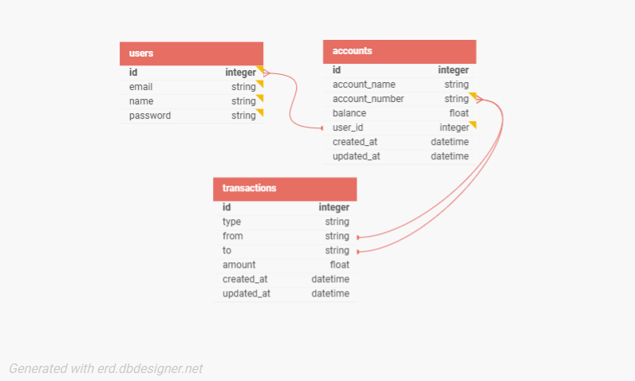

# Lendsqr BE Test

## Assessment

The assessment is to create a wallet service with the following functionalities:

- A user can create an account.
- A user can fund their account
- A user can transfer funds to another user’s account
- A user can withdraw funds from their account.
- A user with records in the Lendsqr Adjutor Karma blacklist should never be onboarded

## The Approach

### Tech stack

The technologies used are:

- NodeJS
- Express JS
- KnexJS ORM
- MySQL database
- TypeScript

### Database design



The database design is such that a user can create multiple accounts linked with the user's id. Also, a record is created for every transaction made on an account.

### API Endpoints

#### Authentication Endpoints

- `POST /api/auth/login`
- `POST /api/auth/register`

#### User Endpoints

- `GET /api/user/get-user`
- `POST /api/user/change-name`
- `POST /api/user/change-password`

#### Account Endpoints

- `GET /api/account/get-account/:id`
- `DELETE /api/account/delete-account/:id`
- `POST /api/account/create-account`
- `POST /api/account/fund-account`
- `POST /api/account/withdraw`
- `POST /api/account/transfer`
- `GET /api/account/all-transactions/:accountNumber`
- `GET /api/account/filter-transactions/:accountNumber?key=?value=`

| Method | Endpoint                                                    | Input                         | Output                            | Errors                                                                                                                                               |
| ------ | ----------------------------------------------------------- | ----------------------------- | --------------------------------- | ---------------------------------------------------------------------------------------------------------------------------------------------------- |
| POST   | /api/auth/login                                             | `{email, password}`           | 200 `{message, user, token}`      | `401` - Invalid password, `401` - User with email not found                                                                                          |
| POST   | /api/auth/register                                          | `{name, email, password}`     | 201 `{message, user, token}`      | `403` - You have been blacklisted `409` - User already exists                                                                                        |
| GET    | /api/user/get-user                                          | Nil                           | `{message, user}`                 | `401` - Invalid token                                                                                                                                |
| POST   | /api/user/change-name                                       | `{name}`                      | 201 `{message, user}`             | `401` - Invalid token                                                                                                                                |
| POST   | /api/user/change-password                                   | `{password, newPassword}`     | 201 `{message, user}`             | `401` - Invalid token, `403` - Incorrect password                                                                                                    |
| GET    | /api/account/get-account/:id                                | `id` - account id             | 200 `{message, account}`          | `401` - Invalid token, `422` - Invalid id, `403` - You do not own this account, `404` - Account not found                                            |
| DELETE | /api/account/delete-account/:id                             | `id` - account id             | `204`                             | `401` - Invalid token, `422` - Invalid id, `403` - You do not own this account, `404` - Account not found                                            |
| POST   | /api/account/create-account                                 | `{accountName}`               | 201 `{message, account}`          | `401` - Invalid token                                                                                                                                |
| POST   | /api/account/fund-account                                   | `{accountNumber, amount}`     | 200 `{message, account, receipt}` | `404` - Account not found, `422` - Account number is invalid                                                                                         |
| POST   | /api/account/withdraw                                       | `{accountNumber, to, amount}` | 200 `{message, account, receipt}` | `403` - You do not own this account, `402` - Insufficient funds, `401` - Invalid token, `404` - Account not found, `422` - Account number is invalid |
| POST   | /api/account/transfer                                       | `{accountNumber, to, amount}` | 200 `{message, account, receipt}` | `403` - You do not own this account, `402` - Insufficient funds, `401` - Invalid token, `404` - Account not found, `422` - Account number is invalid |
| GET    | /api/account/all-transactions/:accountNumber                | `accountNumber`               | 200 `{message, account}`          | `422` - Account number is invalid, `404` - Account not found                                                                                         |
| GET    | /api/account/filter-transactions/:accountNumber?key=?value= | `accountNumber, key, value`   | 200 `{message, account}`          | `422` - Account number is invalid, `404` - Account not found                                                                                         |

#### Authorization

Requests to endpoints apart from login and register must be sent with your token as Authorization header. e.g.

```sh
curl -X GET http://localhost:5000/api/user/get-user -H "Authorization: <token>"
```

#### Types

- user 
```ts
  interface User {
  id: number;
  password: string;
  email: string;
  name: string;
}
```
- account
```ts
interface Account {
  id: number;
  account_number: string;
  account_name: string;
  balance: number;
  user_id: number;
}
```
- transaction
```ts
interface Transaction {
  id: number;
  type: string;
  from: string; // account number
  to: string; // account number
  amount: number;
}
```